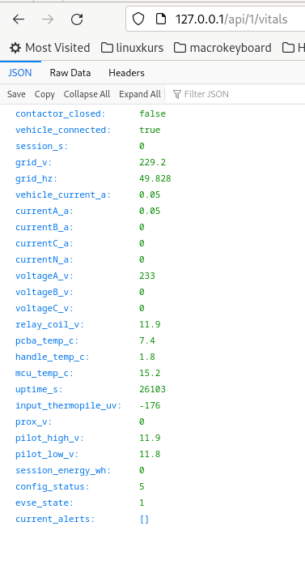

# twc3teslafi-simulator (Tesla Wall Box 3 Simulator)

This program simulates the API output of a Tesla Wallbox 3 and therefore uses data from TeslaFi.

It basically just fakes the output while using information from TeslaFi.

I use this as a workaround to get evcc working with a normal non-smart wallbox, as evcc requires a compatible charger. The twc3 template is special because it lets evcc use Tesla's own api to start/stop and adjust the current level. 

## requirements

- Any wallbox
- A Tesla (except first gen Roadster)
- TeslaFi https://www.teslafi.com/signup.php?referred=philippjohann

## Installation

Set your API-Key in main.py

via docker:

    docker-compose up

## validate

if it's running properly you should get something back when looking at

http://localhost/api/1/vitals

## ToDos

- add geofencing
